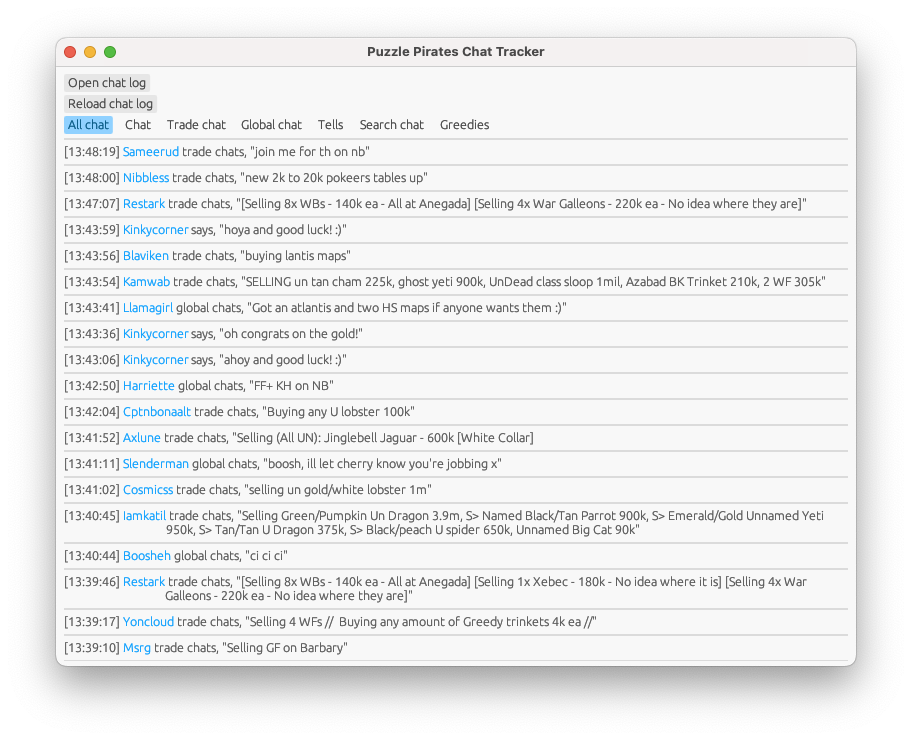

## Puzzle Pirates Chat Tracker
I got fed up missing messages in the chat, so here's something that reads your Puzzle Pirates chat log and presents chat messages in a more searchable way.

<figure>
  
  <figcaption>How the chat tracker looks</figcaption>
</figure>  

### Features
- Separate tabs for the different chat types
- Search player and NPC messages across supported chat types
- Check a pirate's page straight from the chat message, just click their name! (Emerald ocean only)
- Automatically updates with new chat messages
- Simple Greedy hit tracker (Recommended to check out [FirstMate](https://github.com/captain-dread/pillage-helper-web) for a more in depth pillage helper tool)

#### Supported Chat types
- Trade
- Tells (whispers)
- Global
- Regular chat

### Limitations
- This program was built with Emerald ocean in mind. Other oceans may be supported in future (this mainly affects checking pirate pages)
- Only 1000 messages will be displayed in each chat tab. This is planned to be configurable at some point

### How to use
First, [find your chat log](#Finding-your-chat-log).  
Run the chat tracker, and click 'Open chat log'. 
The chat tracker will look for new messages in the background, so you can get back to playing.

##### Finding your chat log
In game:  

- Click the 'Ye' tab
- Click 'Options'
- Click the 'Chat' tab
- See 'Chat Logging' option. Hit 'Choose...'
- Pick a folder you want to store the file in
- Give it a file name
- Hit save  
This is the file you'll want to select when clicking 'Open chat log' in the chat tracker.

### Config
Most users won't need to worry about this section. Anything configurable should be editable through the program's UI.  
Configuration values are pulled from the `puzzle-pirates-chat-tracker.toml` file if available. If it isn't available, it will be created by the program.

The configuration format is [TOML](https://toml.io/en/)

##### Config values
| Value | Use | Example |
|-------|-----|----------
| chat_log_path | The location of the chat file to use | C:\Users\Username\Documents\your_chat_log.txt
| message_limit | The amount of messages to show per chat tab | 1000

### Building
This section is aimed at developers, or anyone wanting to build the program themselves.

- Install [Rust](https://www.rust-lang.org/learn/get-started)
- Clone this repository
- `cargo run` in the repository folder on your machine
